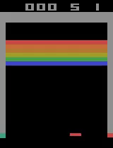

# About Me
Oh, howdy there! 
Glad you made it here.
In this little corner of the internet, I host some the projects I have worked on or are currently working on.

I am Oscar J. Escobar and are about to finish the Applied and Computational Mathematics (ACME) degree at Brigham Young University (BYU) this December.
I love football (i.e. soccer) and am a huge fan of Real Madrid.
In my spare time, I like to cook, watch series and movies, play the piano and guitar, and learn new things.

Feel free to contact me for any question using form found at the bottom of my [website](https://oescoba2.github.io.).
I give a breakdown of the contents therein in a TL;DR format.
I also add some pictures or animations for quicker understanding of the results.

Directories:
* [Modeling_data](#modeling_data): this contains projects where I applied ML, Time Series Analysis, or deep learning in order to model with data and uncertainty.
* [OTC_Dynamics](#otc_dynamics): contains some of the projects where I modeled using dynamics and then applied optimal control theory (OTC).
* [DRL](#drl): contains my work in implementing deep reinforcement learning (DRL) research in order to learn and apply it.
* [DA](#da): contains the work for the data assimilation projects I have worked with.
* [Coursework](#coursework): This directory contains some of the cool homeworks, labs, or small projects I did as part of the classes I took at BYU.

# Modeling_data 

# OTC_Dynamics

# DRL
My friend Justin and professor Dr. Grimsmann got me hooked into RL.
I am happy to say I authored about 85% of the RL labs in ACME.
I started off with DQN and coded up DDQN and dueling architecture following DeepMind's architecture and process.

Here is my agent after 4000 episodes using Google Colab's TPU.

# DA
* particle filter: I worked on particle filter to track 2D submarine in fluid flow with my friends Joseph and Abe.
The goal is to pinpoint the true position based off of a noisy pinged observed position.

Here is visual of my particle filter project.

# Coursework
The contents in this directory comprise:

* HW4_1.py: this were several problems where I applied dynamic programming principles to do my homework.
* HW4_5.py: This algorithm was intended to solve a {0,1} (that is either you take one or zero of an item) knapsack problem of n-items with given weights (w1,...,wn) and values (v1,...,vn)
* binary_trees.py: I very much enjoyed this lab. The lab was intended to help me learn to code a BST tree using some recursive techniques for searching and inserting nodes. It also helped me learn the difference in time complexities of BST vs. AVL vs. Singly Linked Lists. This one tested more of my knowledge about programming thus far as well as comprehension of recursion. I received a 50/50
