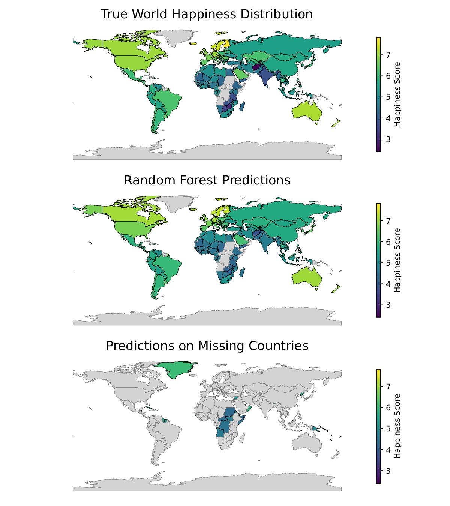
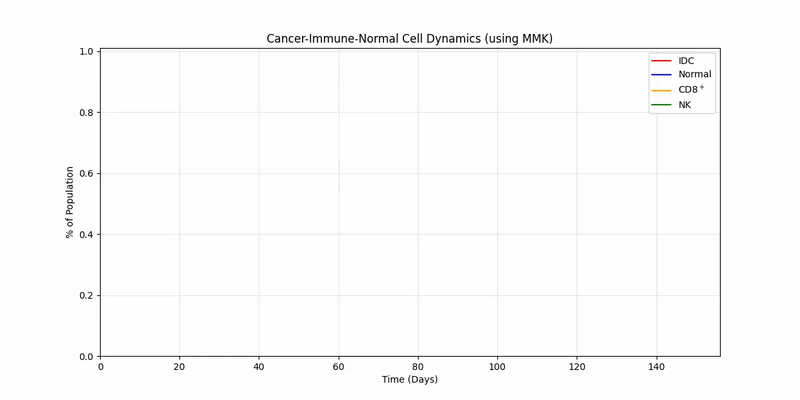
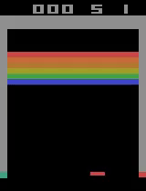
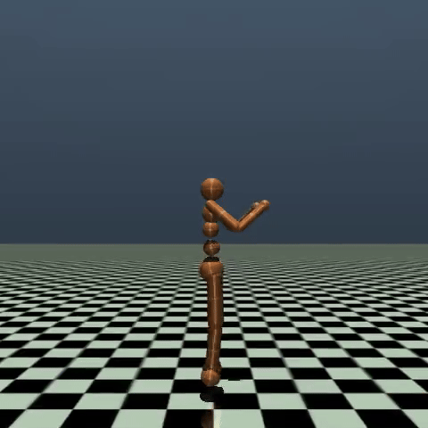
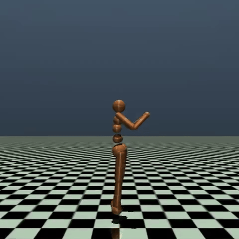
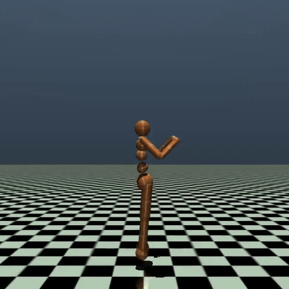
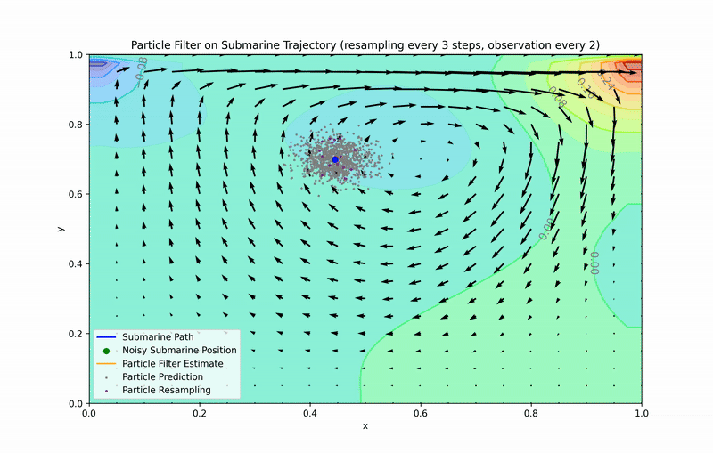

# About Me
Oh, howdy there! 
Glad you made it here.
In this little corner of the internet, I host some the projects I have worked on or are currently working on.

I am Oscar J. Escobar and are about to finish the Applied and Computational Mathematics (ACME) degree at Brigham Young University (BYU) this December.
I love football (i.e. soccer) and am a huge fan of Real Madrid.
In my spare time, I like to cook, watch series and movies, play the piano and guitar, and learn new things.

Feel free to contact me for any question using the form found at the bottom of my [website](https://oescoba2.github.io.).
I give a breakdown of the contents therein in a TL;DR format.
I also add some pictures or animations for quicker understanding of the results.

Directories:
* [Coursework](#coursework): This directory contains some of the cool homeworks, labs, or small projects I did as part of the classes I took at BYU.
* [DA](#da): contains the work for the data assimilation projects I have worked with.
* [DRL](#drl): contains my work in implementing deep reinforcement learning (DRL) research in order to learn and apply it.
* [Modeling_data](#modeling_data): this contains projects where I applied ML, Time Series Analysis, or deep learning in order to model with data and uncertainty.
* [OTC_Dynamics](#otc_dynamics): contains some of the projects where I modeled using dynamics and then applied optimal control theory (OTC).
* [Notes](#notes): I will be putting in the notes and things I learn as I try to implement research papers or other material  related to the content of the of the directories in this repo. I learn better as I summarize and pretend that I will teach someone. So the notes will sound like a summary but at the same time as a sort of lecture. Notes will be split into subdirectories like my content.

If any of work was useful to you, please cite this using
```
@misc{OscarRepo,
author={Óscar J. Escobar},
year={2025},
title={My Work},
url={https://github.com/oescoba2/MyWork},
accessed={},
}
```


# Modeling_data 
* Climate change: another semester long project where we did some time series analysis to determine the effects of climate change on vegetation measurements.
Data was retrieved from NOAA and World Bank as well as NASA.
Our ARMA models were really well in predicting weather patterns.

* Cancer & Unet: this was a weekly lab where I was tasked with implementing a modified UNet to detect cancer.
I was able to achieve 90% accuracy on my UNet implementation.

* Happiness: this a semester long project where we used mutual information, Random Forests, and XGBoost to predict a country's happiness index.
Data was retrieved from the WorldBank.
Our mutual information and random forest regressor had some great results.



# OTC_Dynamics

* IDC: this was a year long project where we first learned to model breast cancer under the effects of chemotherapy and immunological response then applied OTC to Invasive Ductal Carcinoma (IDC) and the AC treatment. 
We were able to find an optimal control that appears to adhere to bang-bang solutions that are expected in chemo OTC.
But the chemo is not properly modeled as learned.
I will be going back to this project.
The GIF below shows the dynamics we modeling with Michaelis Menten Kinetics (MMK).



# DRL
My friend Justin and professor Dr. Grimsmann got me hooked into RL.

* DQN: I coded Google DeepMind's DQN using DDQN and dueling architecture in PyTorch.
This was to help me write the DQN lab for ACME.
Here is my agent after 5000 episodes of training using Google Colab's TPU.
My goal is to expand all the way to Rainbow and R2D2.



* PolicyGrad: I am currently working on bringing a policy gradient lab where students can learn about policy gradients and work up to PPO and SAC.
So far, I have implemented VPG with GAE and actor-critic (as outlined by OpenAI in [here](https://spinningup.openai.com/en/latest/algorithms/vpg.html)). I will be working towards PPO but placing the motivation from natural gradient $\to$ TRPO $\to$ PPO.

Here are some of my results (GIFs have been slowed down)

Training Episode 0



Training Episode 60K (Learning to land with legs straight )



Testing after 60K episodes (First step, sort of)



# DA
* LA Housing: This was a simple model that I did for LA housing for a small project that Dr. Barker gave us for class. 
It utilizes the Kalman filter.
Time series data was obtained from Federal Reserve Bank of St. Louis (available online).

* particle filter: I worked on particle filter to track 2D submarine in fluid flow with my friends Joseph and Abe.
The goal is to pinpoint the true position based off of a noisy pinged observed position.

Here is visual of my particle filter project.



# Coursework
The contents in this directory comprise:

* HW4_1.py: this were several problems where I applied dynamic programming principles to do my homework.
* HW4_5.py: This algorithm was intended to solve a {0,1} (that is either you take one or zero of an item) knapsack problem of n-items with given weights (w1,...,wn) and values (v1,...,vn)
* binary_trees.py: I very much enjoyed this lab. The lab was intended to help me learn to code a BST tree using some recursive techniques for searching and inserting nodes. It also helped me learn the difference in time complexities of BST vs. AVL vs. Singly Linked Lists. This one tested more of my knowledge about programming thus far as well as comprehension of recursion. I received a 50/50

# Notes